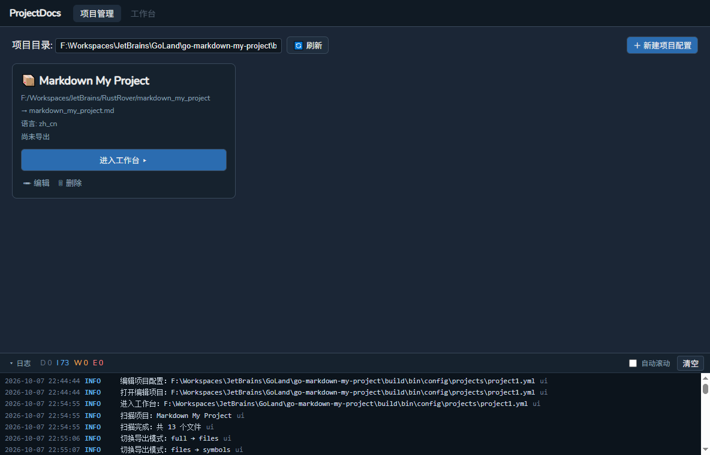
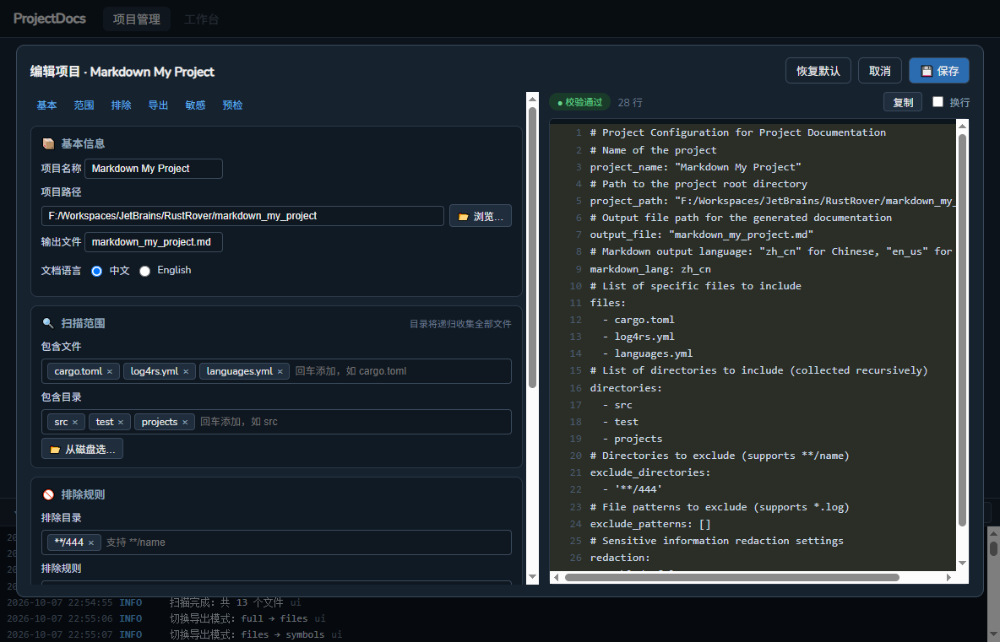
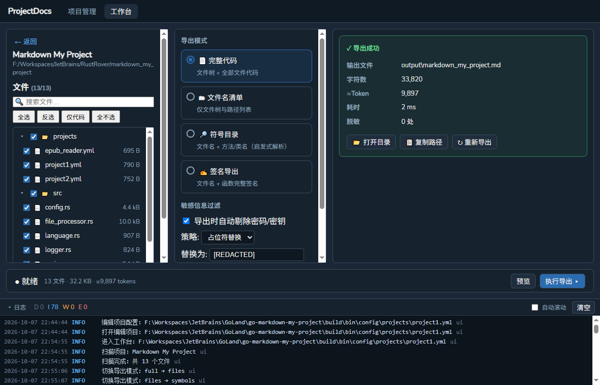

# Project Docs GUI

Aggregate source code from your projects into a single, clean Markdown file — ready to feed to online LLMs for analysis. Desktop GUI (Wails), written in Go with a Vue 3 + TypeScript frontend. Rewritten from the original Rust console tool `markdown_my_project`.

## Screenshots

**Project management** — manage project configs, enter the workbench:



**Project editor** — visual form (left) mirroring `project.yml` in real time (right):



**Workbench** — file tree, export options and result in one screen:



## Features

| ID | Feature | Description |
|----|---------|-------------|
| F1 | Full code export | All configured files aggregated into one Markdown (file tree + file contents), byte-compatible with the legacy Rust output |
| F2 | File manifest export | Paths/file tree only, with per-file language, line count and size |
| F99 | Secret redaction | Detects passwords/API keys/tokens and strips them before export; in-app scan with masked-hit drawer |
| F4 | Token estimate & split | ≈Token estimation (±20%) and greedy chunking by file units |
| F3 | Symbol export | Function/class/struct names per file (regex-based) — **planned, under development** (UI entry exists, backend pending) |

Export modes: `full` · `files` · `symbols`\* · `signatures`\* · `custom` (\* = not yet implemented in the backend; selecting them returns an error).

## UI Structure

Two views, switched via the top tabs:

- **项目管理 (Projects)** — card grid of project configs; create via a 3-step wizard (with native directory picker), edit via the WYSIWYG editor dialog, delete with confirmation. An in-app log panel docks at the bottom.
- **工作台 (Workbench)** — three-pane layout, everything on one screen:
  - Left: project info + collapsible file tree (cascade checkboxes, search, select-all/invert/code-only)
  - Middle: export mode cards, secret-redaction options (scan → masked hits drawer), token split control
  - Right: content outline preview before export; result card afterwards (open folder / copy path / re-export)
  - Bottom status bar: live checked-file stats (count · size · ≈tokens) + export actions

## Tech Stack

- **Backend**: Go 1.22+, Wails v2, `gopkg.in/yaml.v3`, goroutine worker pool, `log/slog` + rolling file
- **Frontend**: Vue 3 + TypeScript + Pinia + vue-router + Vite (pnpm)

## Project Layout

```
├── main.go                       # Wails GUI entry
├── app/app.go                    # Thin Wails binding layer (dialogs, scan, export, YAML mirror)
├── core/                         # Pure Go, independently testable (no Wails imports)
│   ├── config/                   # Project config load/validate/save + comment-template YAML writer
│   ├── scanner/                  # File scanning, exclusion rules, parallel read
│   ├── generator/                # Markdown generation (full/files modes) + file tree
│   ├── symbol/                   # Multi-language symbol extraction (regex v1)
│   ├── redactor/                 # Secret detection & redaction engine
│   ├── token/                    # Token estimation & chunk splitting
│   └── logger/                   # slog console + rolling file
├── assets/langs.yml              # Extension → language mapping
├── config/projects/              # Sample project configs (*.yml)
├── frontend/
│   ├── src/views/                # ProjectsView / Workbench / FileTree / Wizard / SensitiveDrawer
│   ├── src/components/editor/    # WYSIWYG project editor (form + live YAML preview)
│   ├── src/components/LogPanel   # In-app log dock
│   └── src/api/bindings.ts       # Handwritten wrapper over window.go.app.App
├── dosc/                         # Design docs & screenshots
├── COMMIT.md                     # Commit message for the pending changeset
└── build.ps1                     # One-click build script (Go + pnpm → build/bin/)
```

## Build

Requirements: **Go 1.22+**, **Node + pnpm**, optional **Wails v2 CLI** (auto-installed by the script if missing).

```powershell
.\build.ps1                # full build → build/bin/
.\build.ps1 -Clean         # wipe build/bin/ first
.\build.ps1 -SkipInstall   # skip pnpm install
.\build.ps1 -SkipFrontend  # skip frontend build (reuse frontend/dist)
.\build.ps1 -Package       # also build NSIS installer (requires makensis)
```

Output in `build/bin/`:

```
build/bin/
├── project-docs-gui.exe    # Desktop GUI (Wails)
├── assets/langs.yml        # runtime language mapping (required by the exe)
└── config/projects/*.yml   # sample project configs
```

## Usage

### GUI

Run `build\bin\project-docs-gui.exe`. Default projects directory is `config/projects` (relative to the exe's working directory).

1. **Projects view**: click `＋ 新建项目配置` to launch the wizard (pick a directory with the native dialog — name/output file are auto-filled), or `✏ 编辑` to open the WYSIWYG editor: the left form and the right YAML preview stay in sync; save runs validation and a count-only pre-scan.
2. **Enter workbench ▸**: confirm file selection in the tree (search / select-all / code-only filters), pick an export mode, optionally run a secret scan (hits open in a masked drawer; exporting with redaction on but unscanned prompts first), then hit `执行导出`.
3. **Result**: the right pane switches to a result card — output path, chars, ≈tokens, duration — with `打开目录` / `复制路径` / `重新导出`.

Progress and errors are shown inline and mirrored in the log dock; empty/bad paths produce explicit error messages.

## Configuration

Project config (`config/projects/*.yml`). The GUI editor writes this exact structure (with English comment templates) via its YAML preview:

```yaml
project_name: "My Project"
project_path: "C:/Workspaces/my-project"
output_file: "my_project.md"
markdown_lang: zh_cn            # zh_cn | en_us
files: [cargo.toml]             # individual files
directories: [src]              # recursive directories
exclude_directories: ["**/444"] # prunes whole directories; "**/name" matches anywhere
exclude_patterns: ["*.log"]     # glob (* / ?) or prefix match on relative paths
max_file_size: 1048576          # bytes; 0/omitted = no limit

# ─── v2 ───
export_mode: full               # full | files | symbols | signatures | custom
redaction:
  enabled: true
  placeholder: "[REDACTED]"
  strategy: placeholder         # placeholder | drop_line
  allowlist: []                 # confirmed false positives: "relpath:line:rule"
  custom_patterns: []           # extra RE2 regexes
split_tokens: 0                 # >0 enables chunking, e.g. 100000
```

## Secret Redaction (F99)

Two-phase by design — never silently rewrites code:

1. **Scan**: builtin rules (password assigns, AWS keys, GitHub PATs, OpenAI keys, Slack tokens, JWTs, PEM blocks, DB connection strings, Basic/Bearer auth) report masked findings in the drawer — plaintext never reaches the UI or logs.
2. **Confirm & export**: hits are replaced with `[REDACTED]` (or the line dropped via `strategy: drop_line`). PEM blocks are replaced as a whole. Confirmed false positives go into `redaction.allowlist` (key = `relpath:line:rule`) and are skipped afterwards. Logs record counts and rule names only.

Built-in false-positive suppression: values containing `your_`, `xxx`, `example`, `changeme`, `placeholder`, `dummy`, `test123`, `${...}`, `{{...}}`, or env references (`process.env`, `os.Getenv`, `import.meta.env`) are ignored.

## Development

```powershell
go test ./core/...          # unit tests (generator golden regression, symbol, redactor, token)
wails dev                   # live-reload GUI development
cd frontend && pnpm dev     # frontend-only dev server
```

Design documents (UI redesign, output modes, editor dialog) live in `dosc/`.

## Notes & Limitations

- `symbols` / `signatures` export modes have UI entries but the backend templates are still under development (see `dosc/2026-10-07-output-mode.md`); selecting them returns an error for now.
- Regex-based symbol extraction is heuristic (directory-level reference for LLMs, misses are acceptable); a tree-sitter upgrade path is planned.
- Token estimation is ±20%, for capacity planning only.
- `full` mode on huge projects may produce very large files — prefer `split_tokens`.
- Scanned paths are stored with `/` separators for cross-platform output; only `full`-mode file headings keep native separators (byte-compat with the legacy Rust output).
